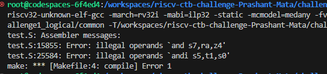
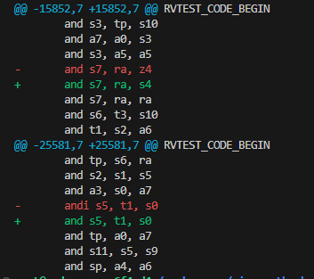

# riscv_ctb_challenges

# Readme file for the challenge1_logical

Bugs found are illegal operands used in two instructions (in test.S) as shown in the image below:

At line number 15855, z4 register is used which is not a valid RISC-V register. To fix this I have replaced the z4 register with s4 register.

At line number 25584, "andi" instruction has illegal operands. "andi" is a I-type instruction while the opearands are of R-type instructions, so replaced the "andi" instruction with "and" instruction. Fix can be checked in below image.

 