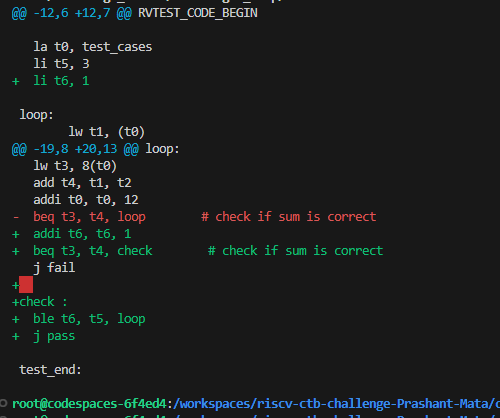

# riscv_ctb_challenges

# Readme file for the challenge1_loop

The bug is in the loop, the loop is an infinite loop here. As from the code below if all the 3 sums are correct, it keeps on checking the further memories (loads 0) and 0+0=0 continues in the loop. 

loop:
	lw t1, (t0)
    lw t2, 4(t0)
    lw t3, 8(t0)
    beq t3, t4, loop        # check if sum is correct
    j fail

Fixing the bug: 

Fixed code/ changes from the original code can be checked in the attached image .

  li t5, 3 // loading t5 with the number of sums we want to check, that is, 3
  li t6, 1

loop:
	lw t1, (t0)
  lw t2, 4(t0)
  lw t3, 8(t0)
  add t4, t1, t2
  addi t0, t0, 12
  addi t6, t6, 1
  beq t3, t4, check        # If the sum is correct go to check, otherwise fail
  j fail                   
  
check :
  ble t6, t5, loop     # If the number of sums checked are less than 3 then only go to loop, otherwise pass
  j pass

  The above code is a fixed code with some extra logic added with relevant comments.