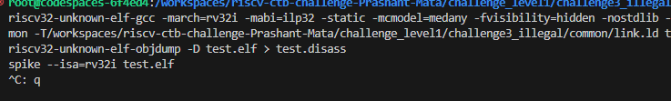
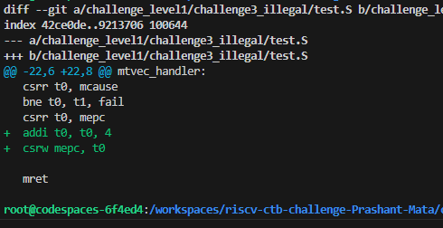

# riscv_ctb_challenges

# Readme file for the challenge1_illegal

The bug is in the exception handler part. mepc has the address of the exception causing line and mret takes the execution back to the address stored in the mepc, which is nothing but exception causing instruction address. So the loop continues like this :

     ---->  Exception causing address -- > exception handler
     |                                            |
     |                                            |
     ---------------------------------------------- 

While executing the buggy code the spike simulation hangs, can be seen in this image .

So to break this loop, In the exception handler 2 lines are added :

  li t1, CAUSE_ILLEGAL_INSTRUCTION
  csrr t0, mcause
  bne t0, t1, fail
  csrr t0, mepc
  addi t0, t0, 4  # Adding 4 to the mepc stored address
  csrw mepc, t0   # writing the same to mepc

  After this the mepc points to the next instruction that causes exception and the loop breaks. 

  Fixes/ changes can be seen here  .