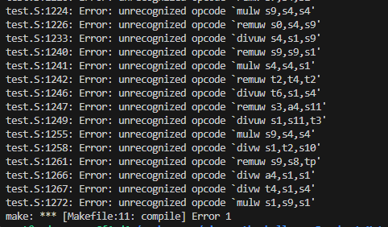
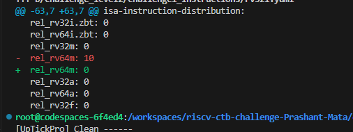

# riscv_ctb_challenges

# Readme file for the challenge1_instructions

The bug is in the rv32i.yaml file, By making rel_rv64m: 10 in the configuration file, the testcase generates mul/div/rem instructions which are not part of the base RV32I ISA.

Image from the spike simulation can be checked here : .

Fix is to make rel_rv64m: 0 in the yaml file. Fix /changes can be seen in the image  .