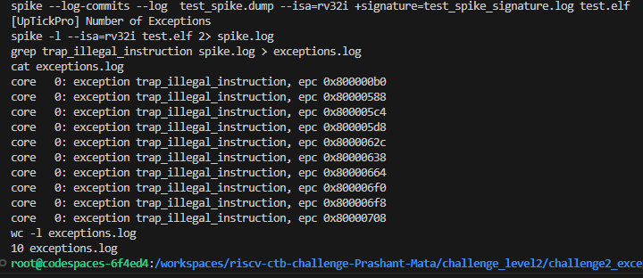

# riscv_ctb_challenges

# Readme file for the challenge2_exceptions

The following pre_program_macro has been added in the yaml file taken from the previous challenge, pre_program_macro contains the exception handler:

auipc t1, 0x0;                         // Loading current PC value in register t1
addi t1, t1,16;                        // Making t1 to store the address of exception handler
csrw mtvec, t1;                        // Writing the address of exception handler in mtvec
jalr t5,t1,16;                         // Jumping to the next address of exception handler so that it is not executed in pre-program macro
csrr t1, mepc;   <exception_handler>   // Reading address of exception causing instruction
addi t1,t1,4;                          // Adding 4 to the address read in previous instruction
csrw mepc,t1;                          // Storing next address to mepc (next to the exception causing instruction)
mret;                                  // Return to the address pointed by mepc

  
With this, one more change is ecause02=9 is set in the Exception generation section, as already 1 illegal instruction is generated and 9 more are added to make overall count of 10.

The end logs showing the successful simulation can be checked in image  .