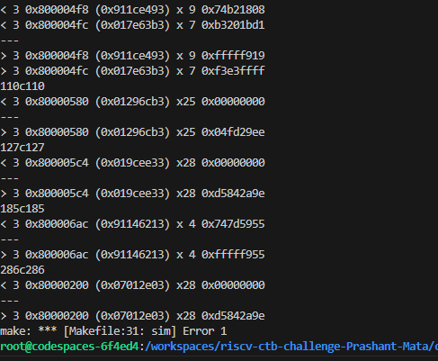

# README for challenge 3

Coverage part:

Cloned risc-dv tool in the riscv_dv_coverage directory. Was able to run the tests like riscv_arithmetic_basic_test, riscv_jump_stress_test and riscv_rand_instr_test.

Issues faced: Tests were breaking or the codespace was breaking when trying to run the tests with large number of instructions. Could not run the complete regression because of this isssue coming again and again. 

Was able to hit coverage of around 50% for almost all covergroups with around 171 logs as shown in the image . The coverage report can be checked in the file CoveragReport.txt.

Bugs:

In the images , ,  when checked the test_disass file it was found that the issue was coming from below instructions:

or s2,a7,a1
ori a5,s9,1718
srli	t5,s2,0xc
addi	t4,t5,-1335
It can so happen that the subsequent differences are because of the first difference. And for the first instruction the registers a7 and a1 has the same values in spike and rtl, so there seems some issue in the instruction excecution stage as from the dump it can be seen that instructions are fetched properly. 

There seems some issue in the execution of OR instructions.

